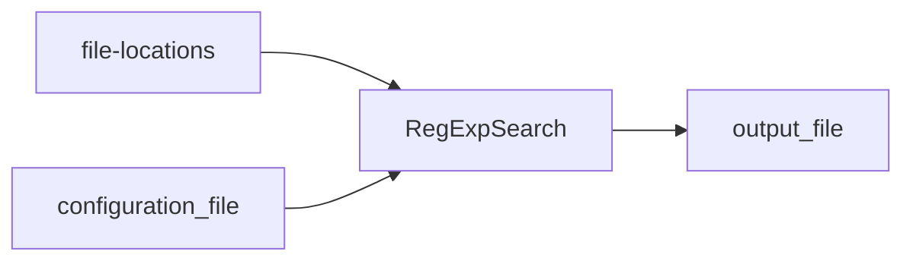

# RegExpSearch
Search through one or more files, based on regular expressions.

## Usage

> java -jar ./RegExpSearch.jar -f "[file location(s)]" -c [configuration file location] -o [output file location]

## Diagram



## Example

> java -jar ./RegExpSearch.jar -f "./logs/\*.txt\*" -c ./RegExpSearch.conf -o ./RegExpSearch.txt

## Parameters
The application takes the following three parameters
- The location(s) of the files to search in
- The location of the configuration file
- The location for the output file

## Test
The following is a sample Bash script to test the application:

```console
#!/bin/bash
@echo off
clear

# Remove the old results file
rm ~/workspace/RegExpSearch/RegExpSearch.txt

# Go into the working directory
pushd ~/workspace/RegExpSearch/bin

# Execute the search
java -jar ./RegExpSearch.jar -f "~/workspace/RegExpSearch/logFiles/*.txt*" -c ~/workspace/RegExpSearch/RegExpSearch.conf -o ~/workspace/RegExpSearch/RegExpSearch.txt

# Review the results
more ~/workspace/RegExpSearch/RegExpSearch.txt

# Go back where we came from
popd
```

The following is a sample Batch job to test the application:

```console
@ECHO OFF
CLS

REM Remove the old results file
DEL C:\Users\percy\Documents\RegExpSearch\RegExpSearch.txt

REM Go into the working directory
PUSHD C:\Users\percy\Documents\RegExpSearch

REM Execute the search
java -jar RegExpSearch.jar -f "~\Documents\logFiles\*.txt*" -c C:\Users\percy\Documents\RegExpSearch\RegExpSearch.conf -o C:\Users\percy\Documents\RegExpSearch\RegExpSearch.txt

REM Review the results
ECHO C:\Users\percy\Documents\RegExpSearch\RegExpSearch.txt

REM Go back where we came from
POPD
```

## Version

- 1.0.0 - Fri Dec  9, 2022
	- Original program.
- 1.1.0 - Wed Dec 14, 2022
	- Move the supporting classes FileCollector and RegExpCollector into their own project.
	- Create JUnit test for the aforementioned classes.
	- Create JUnit test for this class.
- 1.1.1 - Sun Dec 18, 2022
	- Made it MS Windows compatible.

### File locations
Use this parameter to specify which files to search in.

The format for this parameter:

> -f "[file location(s)]"

- This can be an absolute path. E.g.: <code>-f "/Users/percyrotteveel/workspace/RegExpSearch/logs/\*.log"</code>
- This can be a relative path. E.g.: <code>-f "./logs/\*.txt"</code>
- This can be a path relative to the home folder. E.g.: <code>-f "~/Documents/Rotteveel/Projects/ACME/logFiles/\*.txt\*"</code>
- For the extension, any standard OS wild card can be used. E.g.: <code>-f "./logs/\*.txt\*"</code>
- For a correct expansion ALWAYS surround the path to the file(s) to search in with double quotes

The application will inspect all the files in the specified directory, including the ones in any sub-directories, which match the specification. E.g.: <code>-f "./\*Logs\*"</code>, could results in the inspection of the following files:

- <code>./WorkflowLogs.log</code>
- <code>./WorkflowLogs.txt</code>
- <code>./WorkflowLogs.txt.1</code>
- <code>./WorkflowLogs.txt.2</code>
- <code>./logs/PreProdLogs.txt</code>
- <code>./logs/StagingLogs.txt</code>
- <code>./logs/TestingLogs.txt</code>

### Configuration file location
Use this parameter to specify where the configuration file can be found.

The format for this parameter:

> -c [configuration file location]

- This can be an absolute path. E.g.: <code>-c /Users/percyrotteveel/workspace/RegExpSearch/RegExpSearch.conf</code>
- This can be a relative path. E.g.: <code>-c ./RegExpSearch.conf</code>
- This can be a path relative to the home folder. E.g.: <code>-c ~/workspace/RegExpSearch/RegExpSearch.conf</code>
- Any standard OS file location specification can be used.

#### Format
For the configuration file, use the following directions:

- One specification per line
- A specification is only used if the line starts with the letter 'Y'; any other characters are ignored; this makes it really easy to test one or more specifications
- Format: [Use the specification (Y/N)?]<code>tab</code>[name for the regular expression]<code>tab</code>[regular expression]
- E.g. <code>Y	DOB	.\*\[d|D]\[o|O][b|B].\*([12]\d{3}-(0[1-9]|1[0-2])-(0[1-9]|[12]\d|3[01])).\*</code>
- The regular expression above searched for any form of spelling for date of birth (DOB), followed by a date (YYYY-MM-DD)

**Note:**

- Every regular expression is used on every line, in every file that matches the specification.

### Output file location
Use this parameter to specify the file where the output has to be written to.

The format for this parameter:

> -o [output file location]

- This can be an absolute path. E.g.: <code>-o /Users/percyrotteveel/workspace/RegExpSearch/RegExpSearch.txt</code>
- This can be a relative path. E.g.: <code>-o ./RegExpSearch.txt</code>
- This can be a path relative to the home folder. E.g.: <code>-o ~/workspace/RegExpSearch/RegExpSearch.txt</code>
- Any standard OS file location specification can be used.

During execution, as soon as the application finds a match for any of the regular expressions, it will write the filename, the line number and the line where the match was found, and which regular expression was a match. E.g.:

> ./logFiles/WorkflowLogs.txt

> 5918	   "patientDOB" : "1982-12-12",

>	DOB

In the aforementioned example:

- The the file ./logFiles/WorkflowLogs.txt
- On line 5918: "patientDOB" : "1982-12-12",
- There was a match for DOB

**Note:**

- If the output file exists, it will be overwritten with each execution
- There is a [bug in MS Windows](https://bugs.eclipse.org/bugs/show_bug.cgi?id=212264), where an asterisk ('*') in a program argument, starting with 'C:' always get expanded. Therefore, use ~ for the user's home directory instead of C:\Users\<user name>

## References

- A good source for finding regular expressions is the [Regular Expression Library](https://regexlib.com "A great place to search for regular expressions").
- A good place for testing regular expressions online is the [Regular expression tester](https://regexr.com "RegExr: Learn, Build, & Test RegEx").